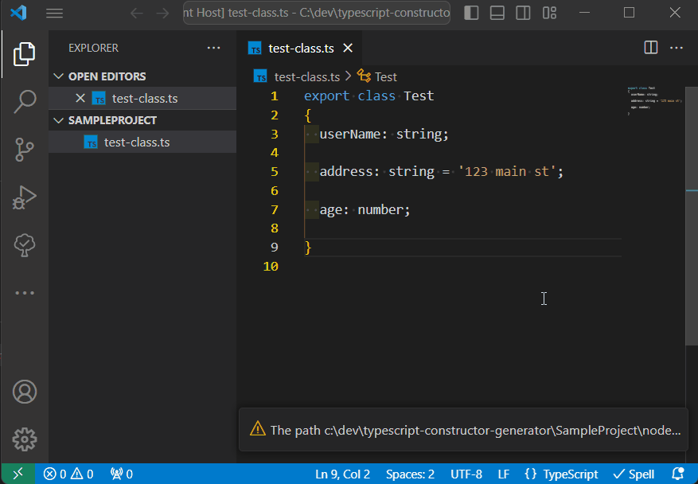

This is inspired by [vscode-gengetset](https://github.com/cybertim/vscode-gengetset). I simplify it with only constructor generator and modify it with my purpose. Also I fixed the issue when the extension command can not work for multiple classes in one file. Since that project isn't maintained and out of date, I'm creating this to support my current need.

**NOTE** This is a fork from [toanvc/typescript-constructor-generator](https://github.com/toanvc/typescript-constructor-generator). That extension seemed abandoned and behind on packages and bug fixes. This brings it up to date.

## Changelog

### v0.1.0

- First version: Supporting only Generate Constructor command.
  - With 3 variables or less, the constructor has single line for inputs.
  - With 4 or more, the constructor will have single line for each variable.

### v0.2.0

- Fix issues
  - #1: Doesn't generate type properly when using lookup type
  - #2: ignore annotation arguments
  - #4: Issue with variable started by #
- Support more types of variables
- Generating constructor without checking existing constructor in class

### v1.0.0

- Port from [toanvc/typescript-constructor-generator](https://github.com/toanvc/typescript-constructor-generator)
- Fixed semi-colon issue in generation
- Change command to **TypeScript: Generate Ctor** so not to clash with existing extension installation

## Install

Get VSCode and grab the extension from the [VSCode Extension Market](https://marketplace.visualstudio.com/items?itemName=toanchivu.tcv-typescript-constructor-generator)

## Usage

1. Just place your cursor within a TypeScript class definition in the text editor window on a blank line below all the properties defined.
2. Open the command palette `ctrl+shift+P` / `cmd+shift+P`.
3. Search for **Generate Ctor**

The generated method will be placed at the cursors position. at the beginning of the line.

**Enjoy!**
